# Project-WallE / 월이(WOLI)

스마트폰을 로봇 머리에 거치하면 집중 모드로 전환되는 **디지털 디톡스 로봇** 프로젝트입니다.  
중요한 연락은 남기고, 불필요한 연결만 잠시 끊도록 돕는 집중 동반 로봇입니다.

> 슬로건: **집중할 땐 함께, 쉴 땐 자유롭게.**

---

## 프로젝트 한눈에 보기

| 구분 | 내용 |
|---|---|
| 제품명 | 월이 (WOLI) |
| 앱 | Android (Kotlin + Jetpack Compose) |
| 펌웨어 | ESP32 (Arduino / PlatformIO, NimBLE) |
| 통신 | BLE (Bluetooth Low Energy) |
| 현재 단계 | **1차 기능 완성 + 실기기 검증 보강 단계** — 중요 연락처, 음성 명령, 백그라운드 집중 보호, BLE 잠금/캘리브레이션, 하드웨어 진단 화면까지 구현 |

### 핵심 아이디어

1. 앱에서 집중 시간·중요 연락처를 설정한다.
2. 스마트폰을 월이 머리 거치대에 **가로**로 올린다.
3. BLE 연결 후 물리적 잠금이 작동하고, 화면은 **눈만 보이는 집중 모드**가 된다.
4. 중요 연락·손 접근 시에만 표정/TTS로 안내하고, 음성으로 답장/전화 제어를 시도한다.
5. 중도 해제 시 리듬 미션 등 마찰 장치를 거친다.

자세한 기획은 루트의 `디지털_디톡스_로봇_월이_기획안.md`와 `SW 예 상시나리오.png`를 참고하세요.

---

## 현 화면 상태

에뮬레이터(Pixel_9a)에서 캡처한 초기 화면입니다. 현재 코드는 캡처 이후 알림/답장/전화 감지/BLE/타이머 기능이 추가된 상태입니다.
원본 이미지는 [`docs/screenshots/`](docs/screenshots/)에 있습니다.

### 세로 — 집중 전

| 화면 | 미리보기 |
|---|---|
| 홈 | 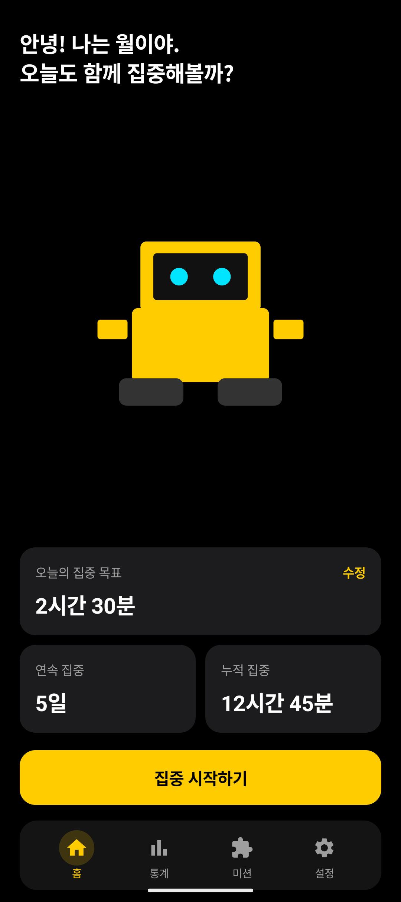 |
| 통계 | 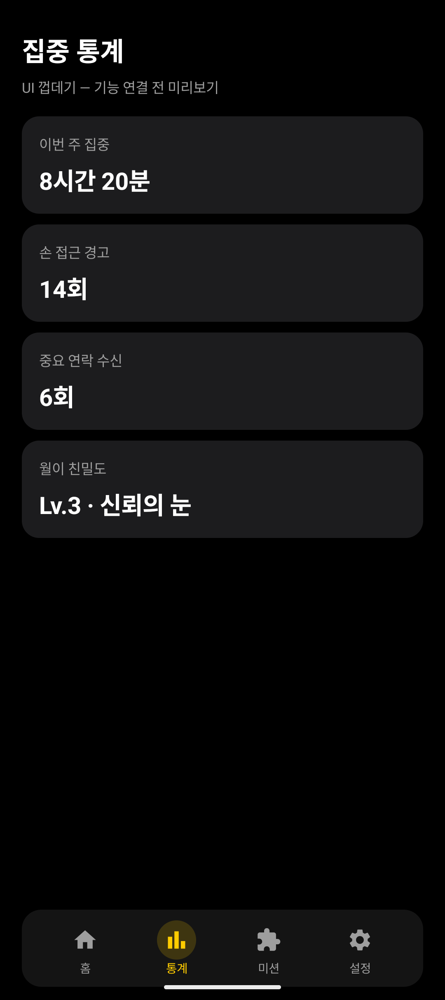 |
| 미션 | 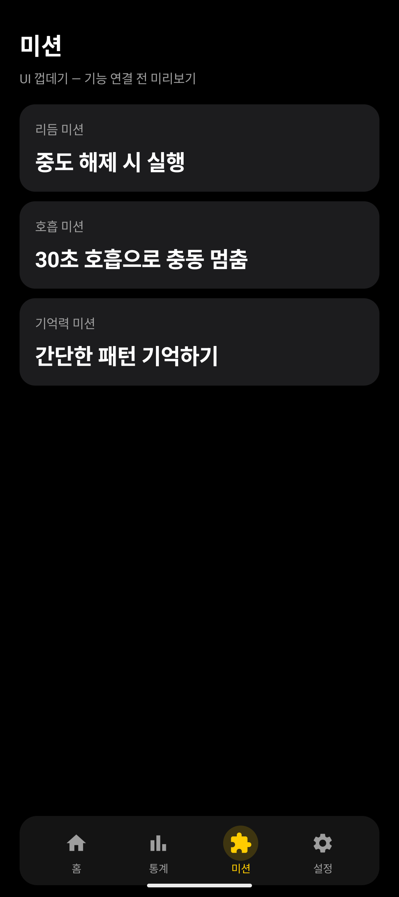 |
| 설정 | 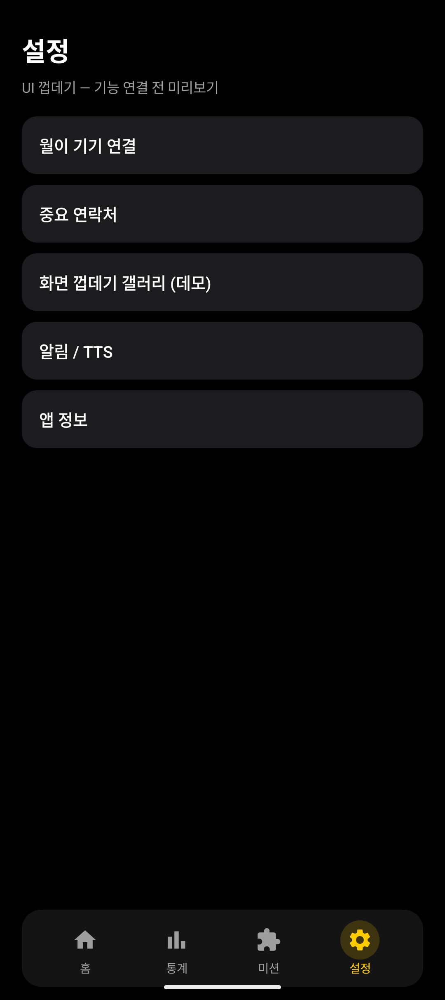 |
| 집중 시간 설정 | 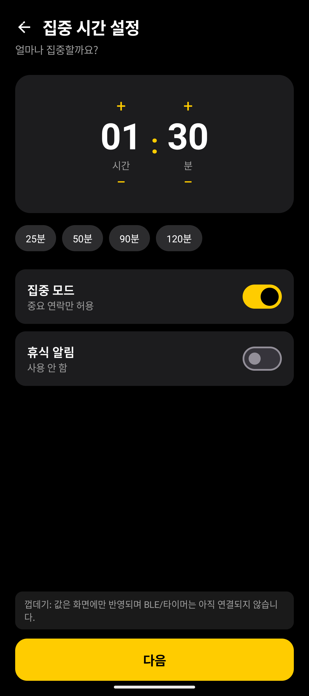 |
| 월이 기기 연결 | 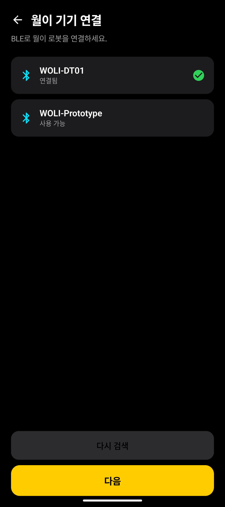 |
| 중요 연락처 | 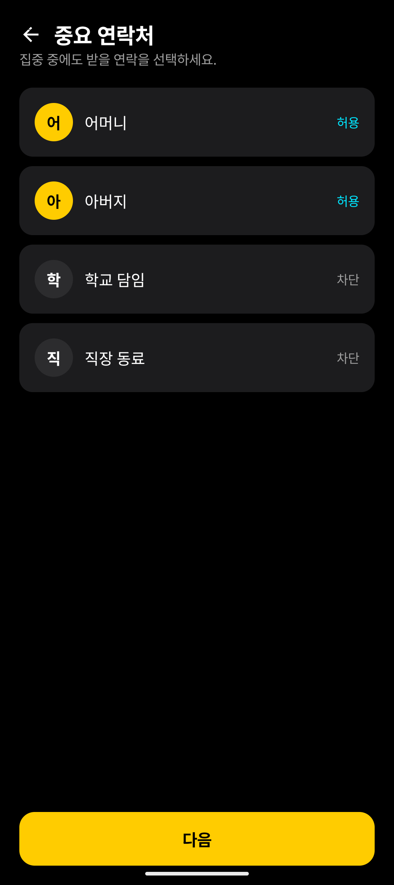 |
| 스마트폰 거치 안내 | 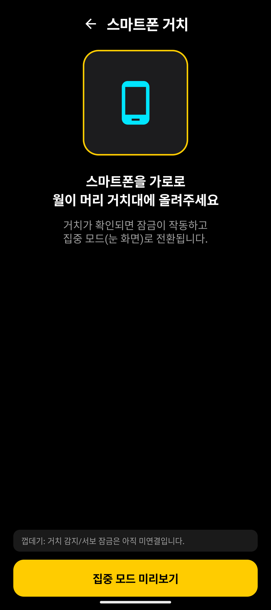 |
| 화면 상태 갤러리 | 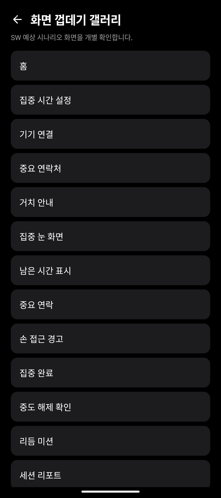 |

### 집중 모드 · 이벤트

| 화면 | 미리보기 |
|---|---|
| 집중 눈 화면 | 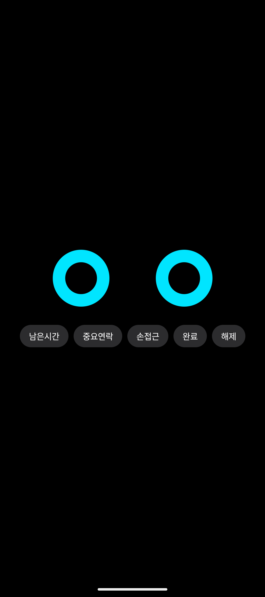 |
| 남은 시간 표시 | 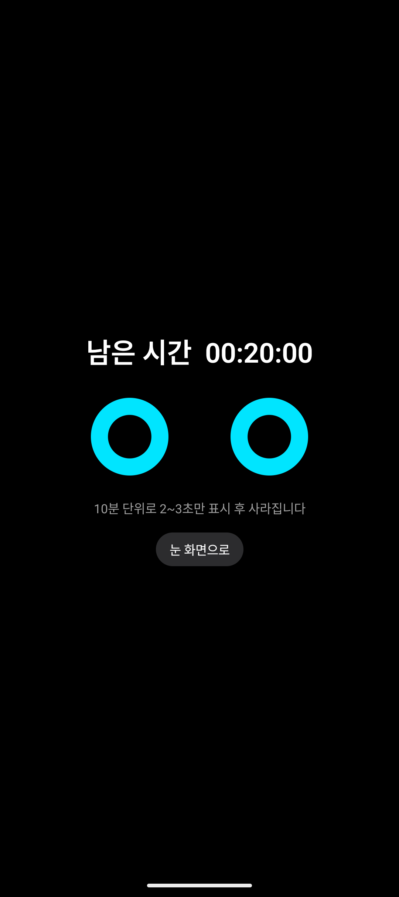 |
| 중요 연락 | 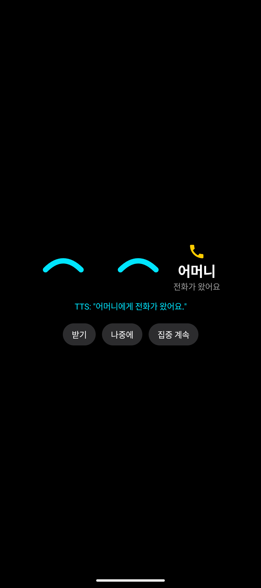 |
| 손 접근 경고 |  |
| 집중 완료 | 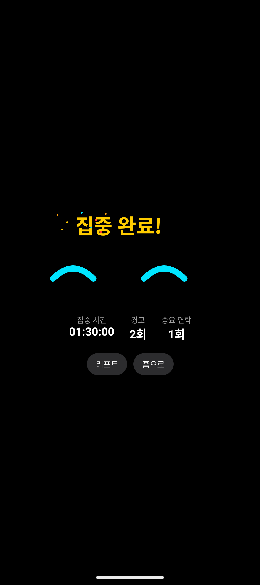 |
| 중도 해제 확인 | 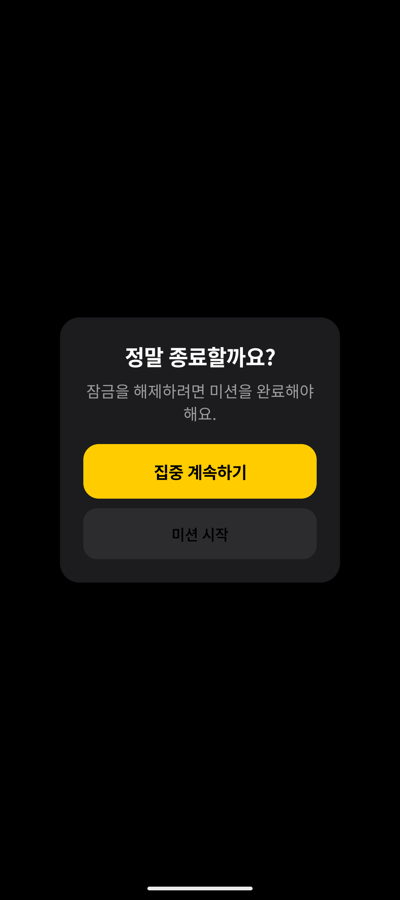 |
| 리듬 미션 | 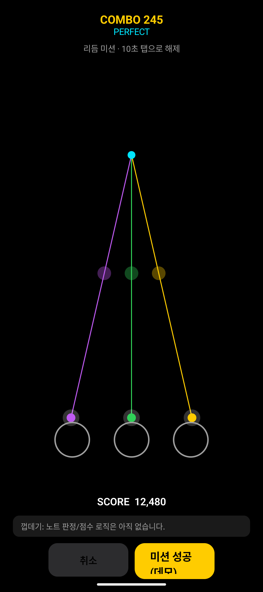 |
| 세션 리포트 | 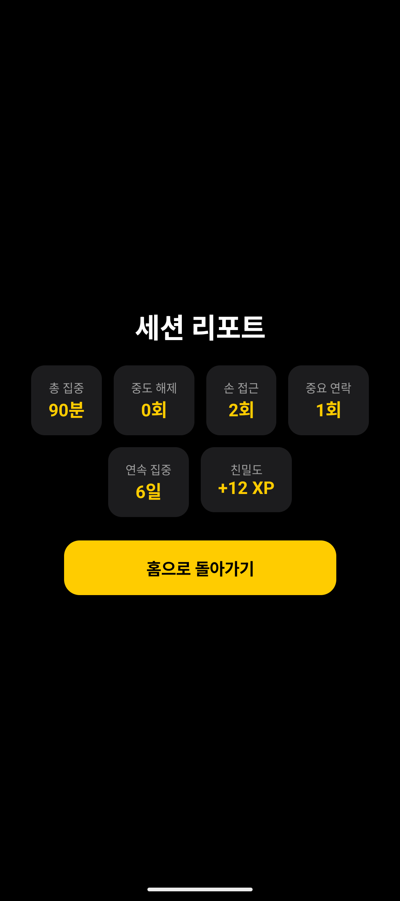 |

---

## 저장소 구조

```text
Project-WallE/
├── android/                 # Android 앱 (Compose + 알림/전화/BLE/세션 로직)
├── firmware/                # ESP32 PlatformIO BLE GATT 펌웨어
├── docs/screenshots/        # 현 화면 상태 캡처
├── docs/RELEASE_CHECKLIST.md # APK/펌웨어 릴리즈 전 검증 항목
├── docs/PRIVACY_NOTICE.md    # 개인정보·권한 사용 안내
├── docs/DEMO_CHECKLIST.md    # 3-5분 발표/시연 순서
├── 디지털_디톡스_로봇_월이_기획안.md
├── SW 예 상시나리오.png
├── HW 구상도.png
├── 월E 구상도.png
└── README.md
```

---

## 개발 시작하기 (처음 clone 한 경우)

### 0) 공통

- Git, GitHub 계정
- 이 저장소 clone:

```bash
git clone https://github.com/kwakminoo/Project-WallE.git
cd Project-WallE
```

### 1) Android 앱

#### 필수 설치

1. **JDK 17** (Temurin / Oracle 등)
2. **Android Studio** (권장: Ladybug 이상) 또는 Android SDK Command-line Tools
3. Android SDK
   - `platforms;android-36` (또는 35+)
   - `build-tools;35.0.0` 이상
   - Platform-Tools

#### SDK 경로 설정

`android/local.properties` 파일을 만들고 SDK 경로를 적습니다.  
(이 파일은 git에 올리지 않습니다.)

```properties
sdk.dir=C\:\\Users\\<YOU>\\AppData\\Local\\Android\\Sdk
```

macOS/Linux 예:

```properties
sdk.dir=/Users/<YOU>/Library/Android/sdk
```

#### 의존성 / 패키지 (Gradle이 자동 다운로드)

앱 모듈(`android/app/build.gradle.kts`)에 포함된 주요 의존성:

| 용도 | 패키지 |
|---|---|
| UI | Jetpack Compose BOM, Material3, Material Icons |
| 네비게이션 | `androidx.navigation:navigation-compose` |
| 생명주기 | `lifecycle-runtime-ktx`, `lifecycle-viewmodel-compose` |
| 로컬 저장 | SharedPreferences 기반 집중 세션, 중요 연락처, 답장 이력 |
| 비동기 | `kotlinx-coroutines-android` |
| BLE | Android BLE scan/connect + WOLI GATT command/status/calibration |

설치/동기화:

```bash
cd android
./gradlew.bat dependencies
./gradlew.bat :app:assembleDebug
./gradlew.bat :app:testDebugUnitTest
```

Android Studio를 쓰는 경우:

1. **Open** → `Project-WallE/android` 폴더 선택
2. Gradle Sync 완료 대기
3. 에뮬레이터 또는 실기기에서 `app` Run

#### 구현된 앱 기능

- 집중 시간 설정과 실제 세션 타이머
- 중요 연락처 수동 저장, 단말 연락처 불러오기, 이름/번호 기반 중요도 매칭
- Android 알림 접근 기반 중요 알림 감지/TTS
- `집중 우선 / 균형 / 시연` 모드 기반 알림 판단 정책
- 일반 카카오톡/문자/DM 기본 제외, 중요 연락처·긴급 표현·허용 앱만 안내
- 답장 가능한 알림의 음성 인식 초안 생성, 음성 명령, RemoteInput 전송
- 답장 전송 이력 저장과 앱별 검증 대시보드
- 전화 수신 상태 감지, 발신자 best-effort 식별, TTS 안내, 받기/거절 API 시도
- Foreground Service 기반 백그라운드 집중 보호
- Android 13+ 포그라운드 알림 권한과 배터리 최적화 상태 점검
- BLE 월이 기기 검색/연결, 시뮬레이션 연결, lock/unlock/status/calibration 명령
- 설정 화면의 하드웨어 검증 도구
- 거치/잠금/손 접근 상태 반영
- 리듬/호흡/기억력 미션
- 세션 완료 리포트와 통계 일부 실제 데이터 반영

### 2) ESP32 펌웨어

#### 필수 설치

1. [VS Code](https://code.visualstudio.com/) + **PlatformIO** 확장  
   또는 [PlatformIO Core CLI](https://platformio.org/install/cli)
2. USB 드라이버 (보드에 따라 CP210x / CH340)

#### 의존성

`firmware/platformio.ini` 기준:

- platform: `espressif32`
- board: `esp32dev` (ESP32-WROOM-32)
- framework: `arduino`
- lib: `h2zero/NimBLE-Arduino`, `madhephaestus/ESP32Servo`

빌드/업로드:

```bash
cd firmware
pio pkg install
pio run
pio run -t upload
pio device monitor
```

현재 `src/main.cpp`는 WOLI BLE GATT 서버를 실행합니다.

| 항목 | 값 |
|---|---|
| BLE 이름 | `WOLI-DT01` |
| Service UUID | `7e7a0001-1f5f-4c2b-9b6f-2d1b7f4f0100` |
| Command UUID | `7e7a0002-1f5f-4c2b-9b6f-2d1b7f4f0100` |
| Status UUID | `7e7a0003-1f5f-4c2b-9b6f-2d1b7f4f0100` |
| Commands | `LOCK`, `UNLOCK`, `START`, `STOP`, `STATUS`, `CAL_LOCK=90`, `CAL_UNLOCK=10` |
| Status payload | `mount=1;lock=0;hand=0;battery=100` |

### 3) (선택) 설계 도구

| 영역 | 도구 |
|---|---|
| UI·UX | Figma |
| 3D 모델링 | Fusion 360 / Onshape |
| 렌더링 | Blender |

---

## MVP 범위 (참고)

**1차 MVP:** 앱 실행, 집중 시간, BLE, 서보 잠금, 눈 화면, 남은 시간 표시, 중요 알림/전화, 음성 답장/명령, 완료/리포트

**현재 저장소:** 1차 MVP 소프트웨어 구현 + ESP32 BLE GATT/Servo 펌웨어 + 기획 문서

### 실기기 검증 체크리스트

- 설정 > 집중 알림 기준에서 `균형` 모드와 허용 앱 상태 확인
- Android 실기기에서 카카오톡/문자/Telegram/WhatsApp 답장 성공 여부 확인
- 일반 메신저 알림은 제외되고 중요 연락처/긴급 알림만 TTS 안내되는지 확인
- Android 제조사별 발신자 번호 전달, 전화 받기/거절 API 허용 여부 확인
- 실제 서보 각도, 리미트 스위치, 손 접근 센서 핀/전기적 안정성 캘리브레이션
- Foreground Service 알림 권한과 배터리 최적화 예외 동작 확인
- 최신 UI 상태에 맞춘 스크린샷 재촬영

자세한 제출 전 점검은 [`docs/RELEASE_CHECKLIST.md`](docs/RELEASE_CHECKLIST.md), 알림 판단 기준은 [`docs/NOTIFICATION_POLICY.md`](docs/NOTIFICATION_POLICY.md), 개인정보 안내는 [`docs/PRIVACY_NOTICE.md`](docs/PRIVACY_NOTICE.md), 시연 흐름은 [`docs/DEMO_CHECKLIST.md`](docs/DEMO_CHECKLIST.md)를 확인하세요.

---

## GitHub

- 원격 저장소: https://github.com/kwakminoo/Project-WallE

대용량/비관련 파일(`TNC Web Re.zip` 등)은 `.gitignore`로 제외합니다.
