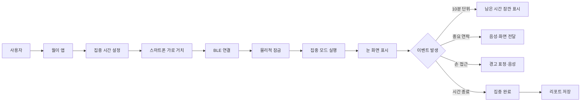
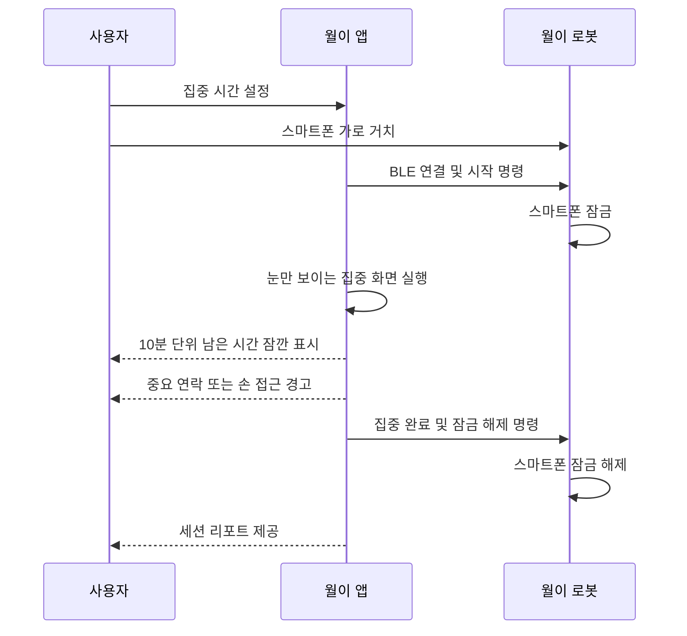

# 디지털 디톡스 로봇 ‘월이(WOLI)’ 기획안

> **한 줄 정의**  
> 스마트폰을 빼앗는 장치가 아니라, 중요한 연결은 남기고 불필요한 연결만 잠시 끊어주는 집중 동반 로봇

---

## 1. 프로젝트 개요

‘월이’는 스마트폰을 로봇 머리 부분의 거치대에 장착하면 전용 앱이 자동으로 집중 모드로 전환되는 디지털 디톡스 로봇이다.  
사용자는 집중 시간을 설정하고 스마트폰을 가로 방향으로 거치한다. 집중 중에는 스마트폰 화면이 월이의 얼굴이 되어 눈 모양만 표시되며, 중요한 연락이나 손 접근 상황에서만 표정과 음성 안내가 나타난다.

월이의 핵심은 별도의 디스플레이·마이크·스피커를 추가하지 않고 스마트폰의 화면, 전면 카메라, 근접 감지 기능, 마이크, 스피커, 알림 기능을 그대로 활용하는 것이다. 로봇 하드웨어는 스마트폰 거치, 물리적 잠금, BLE 연결, 전원 공급 등 최소 기능만 담당한다.

---

## 2. 문제 정의

스마트폰 사용자는 공부나 업무를 시작한 뒤에도 SNS, 메신저, 짧은 영상, 게임, 반복적인 알림 확인으로 인해 집중 흐름이 쉽게 끊긴다.

기존 집중 앱은 사용자가 직접 앱을 종료하거나 다른 앱으로 이동할 수 있어 통제력이 약하다. 반대로 타이머형 잠금 상자는 스마트폰을 완전히 차단하기 때문에 긴급 전화나 중요한 알림까지 놓칠 수 있다. 또한 단순한 차단 방식은 사용자가 집중을 ‘통제’로 인식하게 만들어 장기적인 습관 형성으로 이어지기 어렵다.

월이는 다음 문제를 해결한다.

- 앱만으로는 부족한 자기 통제
- 긴급 연락까지 차단되는 불안
- 집중 시간 중 반복적으로 스마트폰에 손을 대는 습관
- 집중 앱의 낮은 지속 사용 동기
- 단순 타이머가 제공하지 못하는 감정적 상호작용

---

## 3. 고객 타깃층

### 3.1 핵심 타깃

#### 학생·수험생
- 공부 중 SNS와 영상 앱을 반복적으로 확인하는 사용자
- 25분~120분 단위로 집중 시간을 관리하는 사용자
- 일반 타이머보다 캐릭터와 시각적 피드백을 선호하는 사용자

#### 직장인·재택근무자·프리랜서
- 문서 작성, 코딩, 디자인 등 몰입 업무가 필요한 사용자
- 업무 중 메신저와 알림 때문에 집중이 자주 끊기는 사용자
- 중요한 연락만 놓치지 않고 싶은 사용자

#### 디지털 웰니스 관심 사용자
- 자기 전 스마트폰 사용을 줄이려는 사용자
- 독서, 운동, 명상 등 오프라인 습관을 만들고 싶은 사용자
- 디지털 디톡스를 강제 차단이 아닌 재미있는 경험으로 만들고 싶은 사용자

### 3.2 확장 타깃

- 스터디카페 및 도서관
- 기업 사내 집중·웰니스 프로그램
- 부모와 자녀가 함께 사용하는 가정용 집중 기기
- 학교 자기주도학습 프로그램

---

## 4. 핵심 기능

### 4.1 스마트폰 거치 및 자동 집중 모드

사용자가 앱에서 집중 시간을 설정한 뒤 스마트폰을 월이의 머리 부분에 가로로 거치하면 집중 모드가 시작된다.

- 앱 실행
- 집중 시간 설정
- 스마트폰 가로 거치
- BLE 연결 확인
- 집중 모드 자동 시작
- 물리적 잠금 작동

### 4.2 월이 얼굴 화면

집중 모드에서는 스마트폰 화면 전체가 검은색 배경으로 전환되고 월이의 눈만 표시된다.

#### 기본 화면
- 검은색 배경
- 청록색 또는 하늘색 눈 2개
- 타이머, 버튼, 문구는 기본적으로 숨김
- 화면을 로봇의 얼굴처럼 사용

#### 10분 단위 남은 시간 표시
집중 시간이 10분 단위로 줄어드는 순간에만 남은 시간을 짧게 표시한다.

예시:

- 50분 남음
- 40분 남음
- 30분 남음
- 20분 남음
- 10분 남음

남은 시간은 약 2~3초간 표시된 뒤 사라지고 다시 눈만 보이는 기본 화면으로 돌아간다.

### 4.3 손 접근 감지

별도 거리 센서를 추가하지 않고 스마트폰의 전면 카메라, 근접 센서 또는 앱 기반 영상 인식을 활용한다.

- 손이 가까워지면 월이의 눈이 사용자를 따라감
- 일정 거리 이상 접근하면 경계 표정 표시
- “아직 집중 시간이 남았어요”라는 음성 안내
- 손이 멀어지면 기본 눈 화면으로 복귀
- 접근 횟수를 집중 리포트에 기록

### 4.4 중요 연락 전달

사용자는 집중 시작 전에 허용 연락처와 중요 알림을 설정한다.

- 가족
- 학교 또는 직장
- 특정 연락처
- 긴급 전화
- 선택한 메신저 또는 알림 유형

중요 연락이 오면 월이는 잠시 놀란 표정으로 바뀌고 스마트폰 스피커로 내용을 안내한다.

예시:

> “어머니에게 전화가 왔어요.”

사용자는 음성 명령 또는 화면 버튼으로 다음 행동을 선택한다.

- 받기
- 나중에 확인
- 집중 계속

### 4.5 중도 해제 방지 미션

사용자가 집중 시간을 채우기 전에 스마트폰을 꺼내거나 앱을 종료하려 하면 해제 미션이 실행된다.

미션 예시:

- 리듬 게임
- 30초 호흡 미션
- 간단한 기억력 게임
- 집중 종료 이유 선택
- 긴급 해제 버튼 길게 누르기

미션은 완전한 강제 차단이 아니라 충동적인 해제를 한 번 더 생각하게 만드는 행동 마찰 장치로 사용한다.

### 4.6 집중 완료 및 리포트

집중 시간이 끝나면 월이의 눈이 웃는 표정으로 바뀌고 완료 음성이 재생된다.

제공 정보:

- 총 집중 시간
- 중도 해제 횟수
- 손 접근 횟수
- 중요 연락 수신 횟수
- 연속 집중 일수
- 일·주·월별 집중 시간
- 월이 친밀도 또는 성장 단계

---

## 5. 예상 화면 시나리오

### 5.1 세로 화면 단계

1. 홈 화면
2. 월이 기기 연결
3. 집중 시간 설정
4. 중요 연락처 설정
5. 스마트폰 거치 안내

### 5.2 가로 화면 단계

1. 집중 시작
2. 기본 눈 화면
3. 10분 단위 남은 시간 잠깐 표시
4. 중요 연락 도착
5. 손 접근 경고
6. 집중 완료
7. 중도 해제 미션
8. 세션 리포트

### 화면 방향 원칙

- 집중 시작 전: 세로 화면
- 스마트폰 거치 후: 가로 화면
- 집중 모드 이후 모든 화면: 일반적인 스마트폰 가로 비율 유지
- 집중 기본 화면: 눈만 표시
- 시간 정보: 10분 단위에서만 잠깐 표시
- 알림·경고·완료 화면: 필요한 정보만 짧게 표시

---

## 6. 기존 제품과의 차별성

| 제품 유형 | 기존 한계 | 월이의 차별점 |
|---|---|---|
| 집중 앱 | 사용자가 쉽게 종료 가능 | 스마트폰 거치와 물리적 잠금 결합 |
| 타이머 잠금 상자 | 연락과 알림을 모두 차단 | 중요한 연락만 선별 전달 |
| 포모도로 타이머 | 시간 측정 기능 중심 | 손 접근 감지, 표정, 음성, 리포트 제공 |
| 반려 로봇 | 감성 상호작용 중심 | 집중 습관 형성에 특화 |
| 스마트폰 웰빙 기능 | 기능적이지만 지속 동기가 약함 | 미션·표정·성장 요소 제공 |

### 핵심 차별화 문장

월이는 앱, 물리적 거치, 중요한 연락 전달, 캐릭터 상호작용을 결합해 디지털 디톡스를 단순한 차단이 아니라 ‘함께 집중하는 경험’으로 전환한다.

---

## 7. 시스템 구성

---

## 8. 하드웨어 구성

### 8.1 필수 하드웨어

| 부품 | 역할 | 예상 단가 |
|---|---|---:|
| ESP32-WROOM-32 개발보드 | 스마트폰 앱과 BLE 통신, 잠금장치 제어 | 약 8,000~10,000원 |
| MG90S 메탈기어 서보모터 | 스마트폰 거치대 잠금·해제 | 약 4,000~6,000원 |
| 마이크로 리미트 스위치 | 스마트폰 거치 여부 확인 | 약 500~1,000원 |
| 5V 보조배터리 | ESP32와 서보모터 전원 공급 | 약 15,000~25,000원 |
| 전원 스위치·배선·커넥터 | 전원 제어 및 내부 연결 | 약 5,000~10,000원 |
| 나사·스프링·고무 패드 | 조립 및 스마트폰 보호 | 약 3,000~7,000원 |
| 3D 프린팅 케이스 | 월이 외형, 거치대, 잠금 구조 | 약 20,000~60,000원 |

### 8.2 제외 가능한 하드웨어

다음 기능은 스마트폰 자체 기능을 사용하므로 별도 부품을 추가하지 않는다.

- OLED 디스플레이
- 별도 마이크
- 별도 스피커
- 별도 손 접근 거리 센서
- 별도 알림 표시 장치
- 별도 카메라

### 8.3 예상 총비용

- 전자부품 및 전원: 약 35,000~55,000원
- 3D 프린팅 케이스 포함: 약 55,000~115,000원
- 스마트폰 및 배송비 제외

> 가격은 기획 단계의 예상치이며 판매처, 배송비, 환율, 재고에 따라 달라질 수 있다.

---

## 9. 소프트웨어 구성

### 9.1 Android 앱

- 언어: Kotlin
- UI: Jetpack Compose
- 통신: Bluetooth Low Energy
- 로컬 저장: Room 또는 DataStore
- 음성 출력: Android TTS
- 음성 입력: SpeechRecognizer
- 손 접근 감지: 전면 카메라 또는 근접 센서 활용
- 알림 처리: Notification Listener
- 집중 타이머: Foreground Service
- 화면 방향: 집중 모드 진입 시 Landscape 고정
- 미션: 간단한 리듬 게임 또는 기억력 게임

### 9.2 ESP32 펌웨어

- 언어: C/C++
- 개발 도구: Arduino IDE 또는 PlatformIO
- BLE 서버
- 스마트폰 거치 감지
- 서보모터 잠금·해제
- 연결 상태 확인
- 비상 해제 처리
- 배터리 상태 전달

---

## 10. 개발환경

| 영역 | 개발 도구 |
|---|---|
| Android 앱 | Android Studio, Kotlin, Jetpack Compose |
| ESP32 펌웨어 | Arduino IDE 또는 VS Code + PlatformIO |
| UI·UX 설계 | Figma |
| 3D 모델링 | Fusion 360 또는 Onshape |
| 외형 렌더링 | Blender |
| 버전 관리 | GitHub |
| 테스트 | Android 실기기, ESP32 개발보드, 3D 프린팅 시제품 |

---

## 11. 앱과 로봇의 역할 분담

### 스마트폰 앱

- 월이 얼굴 표시
- 집중 시간 관리
- 손 접근 감지
- 중요 연락 필터링
- TTS·STT
- 미션 실행
- 집중 기록과 리포트 저장
- 사용자의 모든 주요 인터페이스 제공

### 로봇 하드웨어

- 스마트폰 거치
- 스마트폰 잠금·해제
- BLE 연결
- 물리적 존재감 제공
- 캐릭터 외형 형성
- 비상 수동 해제 제공

---

## 12. MVP 개발 범위

### 1차 MVP

- Android 앱 실행
- 집중 시간 설정
- 스마트폰 가로 거치
- BLE 연결
- 서보모터 잠금·해제
- 검은 화면과 눈 애니메이션
- 10분 단위 남은 시간 표시
- 중요 전화 알림
- 집중 완료 화면
- 기본 리포트

### 2차 개발

- 전면 카메라 기반 손 접근 감지
- 음성 명령
- 중도 해제 미션
- 월이 친밀도·성장 시스템
- 집중 통계 시각화
- 사용자별 표정 설정

### 3차 확장

- iOS 앱
- 클라우드 백업
- 스터디 그룹 기능
- 가족·학교·기업용 관리자 모드
- 월이 캐릭터 스킨
- 주행 또는 고개 움직임

---

## 13. 안전 및 설계 원칙

- 전원이 끊기면 잠금이 풀리는 Fail-open 구조
- 후면 수동 해제 레버 제공
- 배터리 부족 시 자동 잠금 해제
- 긴급 전화 시 즉시 해제 가능
- 스마트폰 화면과 프레임을 보호하는 고무 패드 적용
- 다양한 스마트폰 크기를 수용하는 슬라이드형 거치대
- 집중 방해를 줄이기 위해 기본 화면에는 눈만 표시
- 사용자를 강제로 가두는 장치가 아니라 자발적 집중을 돕는 보조기기로 설계

---

## 14. 최종 핵심 시연 흐름

---

## 15. 슬로건 제안

> **집중할 땐 함께, 쉴 땐 자유롭게.**

또는

> **중요한 연결은 지키고, 불필요한 연결은 잠시 안녕.**

---

## 16. 최종 정리

월이는 스마트폰을 완전히 없애는 제품이 아니라 스마트폰의 기능을 집중에 유리한 방향으로 재구성하는 제품이다. 스마트폰은 화면, 센서, 마이크, 스피커, 알림, 데이터 처리를 담당하고 로봇은 거치, 잠금, 물리적 존재감과 캐릭터 경험을 담당한다.

이 구조를 적용하면 불필요한 하드웨어를 줄이면서도 개발 비용과 제작 난도를 낮출 수 있다. 동시에 사용자는 월이의 눈과 음성을 통해 단순한 타이머보다 친근하고 지속적인 집중 경험을 얻을 수 있다.
